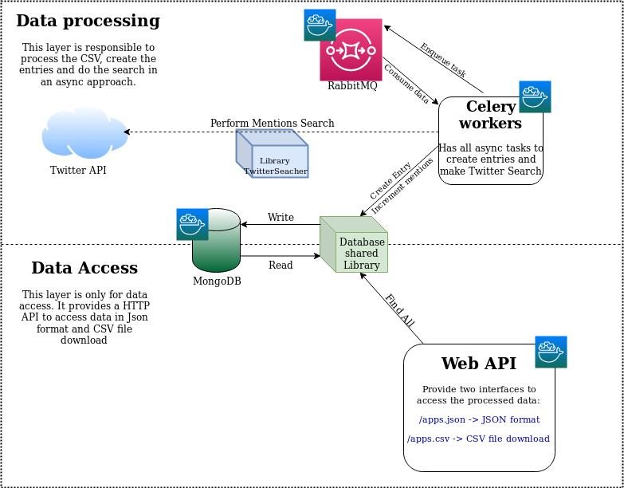
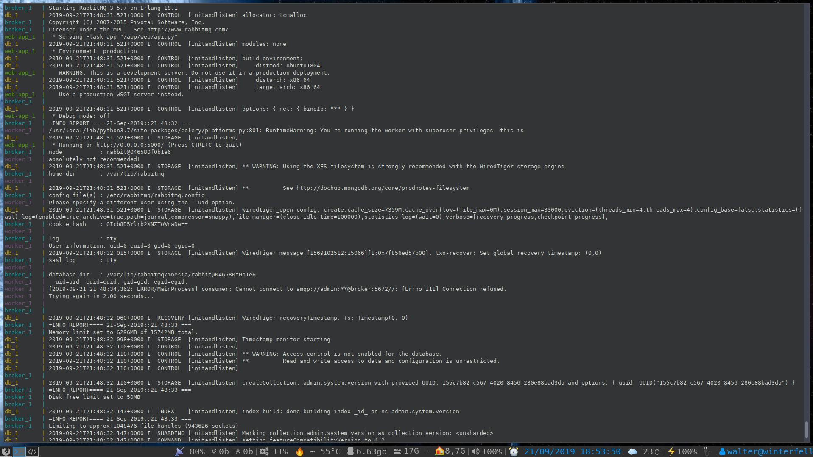
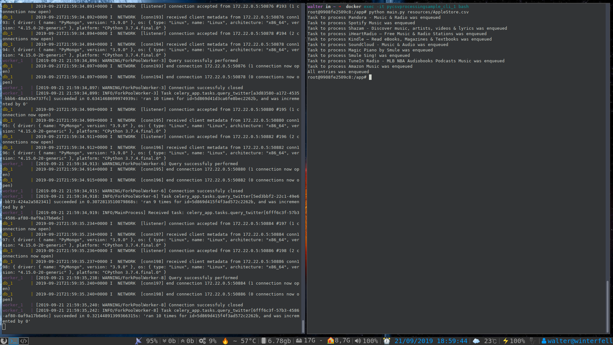

## Architectural overeview

### Distributed architecture
This application uses a distributed architecture which provides a power of scalability and resilience. I decides to distribute this in few elements as described below:

- Workers: This element is basically a Celery app which gonna receive request trough a RabbitMQ queue and process the data in an async approach. It uses some library which gonna to be described here.
- Libs: The main point of data processing, and listed as:
    - csv-processing: The lib responsible for do all the filter and map as described in the requirements: Filter by category, order by reviews count and map as described in the requirements;
    - TwitterSearcher: The lib which just wraps some functionalities from twython;
    - Database: A lib which wraps some functionalities from pymongo, applied in our context;
- Webapp: A sample flask API which respond the result as JSON or as a CSV download file;
- Cli: a script which open the CSV input file, pre-process it by using the csv-procesing lib and perform async tasks in Celery to reach the Twitter API and get the search count, saving it in the database;

The approach here is simple as described below:

- The file is processed and we got the first 10 entries which are Books or Music ordered by reviews count;
- For each entry, perform(enqueue) an async task to create these entries in the database;
- For each entry creation task, it gonna perform(eneuque) another async tasks to get count from twitter API and increment it in the `n_citacoes` field;
    - Each entry peform the Twitter search/update up to 10 times, due to API limitations



### Used stack

In this project I used the following stack:

- Python: Language used in the project
- Flask: Used as web framework;
- MongoDB: Used as database;
- RabbitMQ: Used as broker to perform async tasks;
- Docker/Docker-compose: Used as infrastrcture


## Running the system

### Prerequisites
First of all, I am assuming you have docker and docker-compose installed in your computer. Whether you do not have this, please follow [This link](https://docs.docker.com/compose/install/) to configure it in your system.
All the other dependencies are installed in the system when the container are built. It is also possible to run this in your computer as host, but it could by kinda tricky, so let's keep it simple. :)

I am also assuming you already have this project cloned in your computer.


### Running and building the project

Before start you gonna need to create a account in Twitter, configure a dev App and also get the consumer key/secret and the token key/secret and configure correctly in the `.env` file as described below:

```

TWITTER_CONSUMER_KEY=your_twitter_consumer_key
TWITTER_CONSUMER_SECRET=your_twitter_secret
TWITTER_TOKEN_KEY=your_twitter_token_key
TWITTER_TOKEN_SECRET=your_twitter_token_secret
```

To build and run the project, you just gonna need to perform the following command:

```
walter in ~/Workspace/py-csv-processing-sample (master) ➜  docker-compose up --build
Creating network "pycsvprocessingsample_integration_network" with the default driver
Building worker
Step 1/8 : FROM python:3
 ---> 02d2bb146b3b
Step 2/8 : ADD requirements-celery.txt requirements.txt
 ---> Using cache
 ---> 3796e5b2f9e5
Step 3/8 : RUN pip3 install -r requirements.txt
 ---> Using cache
 ---> 35890f307e7f
Step 4/8 : ADD ./celery_app /app/celery_app
 ---> Using cache
 ---> 5775414adba0
Step 5/8 : ADD ./db /app/db
 ---> d19f0d23a844
Step 6/8 : ADD ./twitter_searcher /app/twitter_searcher
 ---> ff2a9cae3cda
Step 7/8 : ADD ./web /app/web
 ---> 64b7c20a2afc
Step 8/8 : WORKDIR /app
 ---> Running in 1d84ec44e94e
Removing intermediate container 1d84ec44e94e
 ---> fef9f9fb194e
Successfully built fef9f9fb194e
Successfully tagged pycsvprocessingsample_worker:latest
Building cli
Step 1/11 : FROM python:3
 ---> 02d2bb146b3b
Step 2/11 : ADD ./csv-utils ./app/csv-utils
 ---> Using cache
 ---> d427a692a826
Step 3/11 : ADD ./cli/requirements-cli.txt ./app/requirements.txt
 ---> Using cache
 ---> 6fc68fa1667c
Step 4/11 : RUN pip install -r /app/requirements.txt
 ---> Using cache
 ---> 4bed4a445b81
Step 5/11 : RUN pip install /app/csv-utils
 ---> Using cache
 ---> 0b5209337e4e
Step 6/11 : ADD ./cli/main.py /app/main.py
 ---> Using cache
 ---> 49ebdd4b5d3c
Step 7/11 : ADD ./app/celery_app /app/celery_app
 ---> Using cache
 ---> 333a513aa619
Step 8/11 : ADD ./app/db /app/db
 ---> 4f5fe001c519
Step 9/11 : ADD ./app/twitter_searcher /app/twitter_searcher
 ---> 9ca1f4345945
Step 10/11 : WORKDIR /app
 ---> Running in daf2ed28b177
Removing intermediate container daf2ed28b177
 ---> e10c813e09f0
Step 11/11 : ENTRYPOINT ["tail", "-f", "/dev/null"]
 ---> Running in bc79eb02a70d
Removing intermediate container bc79eb02a70d
 ---> 59d6f6e10bbc
Successfully built 59d6f6e10bbc
Successfully tagged pycsvprocessingsample_cli:latest
Building web-app
Step 1/7 : FROM python:3
 ---> 02d2bb146b3b
Step 2/7 : ADD requirements-web.txt requirements.txt
 ---> Using cache
 ---> 28f2d279641e
Step 3/7 : RUN pip3 install -r requirements.txt
 ---> Using cache
 ---> 2c9ff32053b1
Step 4/7 : ADD ./db /app/db
 ---> 290292616650
Step 5/7 : ADD ./web /app/web
 ---> ce87ce81f4e1
Step 6/7 : WORKDIR /app
 ---> Running in 921261bc83d6
Removing intermediate container 921261bc83d6
 ---> 231cc65f5022
Step 7/7 : ENTRYPOINT flask run --host=0.0.0.0
 ---> Running in 50bc81799428
Removing intermediate container 50bc81799428
 ---> 3f00c1098080
Successfully built 3f00c1098080
Successfully tagged pycsvprocessingsample_web-app:latest
Creating pycsvprocessingsample_broker_1 ... 
Creating pycsvprocessingsample_db_1 ... 
Creating pycsvprocessingsample_broker_1
Creating pycsvprocessingsample_db_1 ... done
Creating pycsvprocessingsample_web-app_1 ... 
Creating pycsvprocessingsample_cli_1 ... 
Creating pycsvprocessingsample_worker_1 ... 
Creating pycsvprocessingsample_web-app_1
Creating pycsvprocessingsample_worker_1
Creating pycsvprocessingsample_cli_1 ... done
```

In the first time it will take a few minutes to complete, since you gonna to download the python, MongoDB and RabbitMQ base images and install all dependencies configured in each requirements.txt.
After everything finishes Successfully, you gonna to see in your terminal something like that:



Let it opened in another terminal(just to debug purpuses), but whether you would like to run it in the deamon mode, just add -d param at the end of the command.
### Getting the results

After building and running the entire distributed system, you gonna to be able to use the "cli"(as know as the script to start the processing) by performing the following commands:

```
walter in ~ ➜  docker exec -it pycsvprocessingsample_cli_1 bash
root@9908fe2509c8:/app# python main.py resources/AppleStore.csv 
Task to process Pandora - Music & Radio was enqueued
Task to process Spotify Music was enqueued
Task to process Shazam - Discover music, artists, videos & lyrics was enqueued
Task to process iHeartRadio – Free Music & Radio Stations was enqueued
Task to process Kindle – Read eBooks, Magazines & Textbooks was enqueued
Task to process SoundCloud - Music & Audio was enqueued
Task to process Magic Piano by Smule was enqueued
Task to process Smule Sing! was enqueued
Task to process TuneIn Radio - MLB NBA Audiobooks Podcasts Music was enqueued
Task to process Amazon Music was enqueued
All entries was enqueued
root@9908fe2509c8:/app# 
```

You gonna to see lots of prompts in the `docker-compose up`(without `-d` param) terminal, which means that the async tasks were enqueued and the worker is performing all the search in the Twitter API and comunicating to the MongoDB to save the data, as you can see below:




### Processing the results

To get the result as CSV, you can perform the following curl command:
```
walter in ~/Workspace/py-csv-processing-sample (master) ➜  
curl http://localhost:8080/apps.json | json_pp >> results/result.json
  % Total    % Received % Xferd  Average Speed   Time    Time     Time  Current
                                 Dload  Upload   Total   Spent    Left  Speed
100  1332  100  1332    0     0   433k      0 --:--:-- --:--:-- --:--:--  433k
Wide character in print at /usr/bin/json_pp line 82, <STDIN> chunk 1.
```
Then you gonna to have the result as json:

```
walter in ~/Workspace/py-csv-processing-sample (master) ➜  cat results/result.json 
[
   {
      "track_name" : "Spotify Music",
      "n_citacoes" : 100,
      "id" : "202",
      "prime_genre" : "Music",
      "price" : "0",
      "size_bytes" : "132510720"
   },
   {
      "price" : "0",
      "size_bytes" : "105009152",
      "n_citacoes" : 100,
      "track_name" : "SoundCloud - Music & Audio",
      "id" : "270",
      "prime_genre" : "Music"
   },
(...)
```

You also can download the result as CSV:

```
walter in ~/Workspace/py-csv-processing-sample (master) ➜  
wget -O results/result.csv http://localhost:8080/apps.csv
--2019-09-21 19:07:52--  http://localhost:8080/apps.csv
Resolving localhost (localhost)... 127.0.0.1
Connecting to localhost (localhost)|127.0.0.1|:8080... connected.
HTTP request sent, awaiting response... 200 OK
Length: 613 [text/csv]
Saving to: ‘results/result.csv’

results/result.csv           100%[==============================================>]     613  --.-KB/s    in 0s      

2019-09-21 19:07:52 (49,3 MB/s) - ‘results/result.csv’ saved [613/613]
```

You of course gonna to see the result in CSV format:

```
walter in ~/Workspace/py-csv-processing-sample (master) ➜  cat results/result.csv 
id,track_name,n_citacoes,size_bytes,price,prime_genre
202,Spotify Music,100,132510720,0,Music
270,SoundCloud - Music & Audio,100,105009152,0,Music
1431,Smule Sing!,100,109940736,0,Music
(...)
```

You also are able to access these routes from the browser whether you prefer, of course!! :)


### Advantages of these architecture

Why using this architecture? The first and main reason is due to its scalability, as you can see above you are able to scale up the workers or even the Web API whether you need:


```
walter in ~/Workspace/py-csv-processing-sample (master) ➜  docker-compose scale worker=4
WARNING: The scale command is deprecated. Use the up command with the --scale flag instead.
Starting pycsvprocessingsample_worker_1 ... done
Creating pycsvprocessingsample_worker_2 ... 
Creating pycsvprocessingsample_worker_3 ... 
Creating pycsvprocessingsample_worker_4 ... 
Creating pycsvprocessingsample_worker_2 ... done
Creating pycsvprocessingsample_worker_3 ... done
Creating pycsvprocessingsample_worker_4 ... done
```

You gonna to see some services being created in the `docker-compose up` command shell:

```
broker_1   | 
broker_1   | =INFO REPORT==== 21-Sep-2019::22:12:49 ===
broker_1   | accepting AMQP connection <0.1862.0> (172.22.0.8:34754 -> 172.22.0.2:5672)
worker_3   | /usr/local/lib/python3.7/site-packages/celery/platforms.py:801: RuntimeWarning: You're running the worker with superuser privileges: this is
worker_3   | absolutely not recommended!
worker_3   | 
worker_3   | Please specify a different user using the --uid option.
worker_3   | 
worker_3   | User information: uid=0 euid=0 gid=0 egid=0
worker_3   | 
worker_3   |   uid=uid, euid=euid, gid=gid, egid=egid,
worker_3   | [2019-09-21 22:12:49,473: INFO/MainProcess] Connected to amqp://admin:**@broker:5672//
broker_1   | 
broker_1   | =INFO REPORT==== 21-Sep-2019::22:12:49 ===
broker_1   | accepting AMQP connection <0.1869.0> (172.22.0.8:34756 -> 172.22.0.2:5672)
worker_3   | [2019-09-21 22:12:49,479: INFO/MainProcess] mingle: searching for neighbors
broker_1   | 
broker_1   | =INFO REPORT==== 21-Sep-2019::22:12:49 ===
broker_1   | accepting AMQP connection <0.1885.0> (172.22.0.8:34758 -> 172.22.0.2:5672)
worker_1   | [2019-09-21 22:12:49,488: INFO/MainProcess] sync with celery@3682778a4d3e
broker_1   | 
broker_1   | =INFO REPORT==== 21-Sep-2019::22:12:50 ===
broker_1   | accepting AMQP connection <0.1901.0> (172.22.0.9:38054 -> 172.22.0.2:5672)
worker_4   | /usr/local/lib/python3.7/site-packages/celery/platforms.py:801: RuntimeWarning: You're running the worker with superuser privileges: this is
worker_4   | absolutely not recommended!
worker_4   | 
worker_4   | Please specify a different user using the --uid option.
worker_4   | 
worker_4   | User information: uid=0 euid=0 gid=0 egid=0
worker_4   | 
worker_4   |   uid=uid, euid=euid, gid=gid, egid=egid,
worker_4   | [2019-09-21 22:12:50,455: INFO/MainProcess] Connected to amqp://admin:**@broker:5672//
broker_1   | 
broker_1   | =INFO REPORT==== 21-Sep-2019::22:12:50 ===
broker_1   | accepting AMQP connection <0.1908.0> (172.22.0.9:38056 -> 172.22.0.2:5672)
worker_4   | [2019-09-21 22:12:50,461: INFO/MainProcess] mingle: searching for neighbors
broker_1   | 
broker_1   | =INFO REPORT==== 21-Sep-2019::22:12:50 ===
broker_1   | accepting AMQP connection <0.1928.0> (172.22.0.9:38058 -> 172.22.0.2:5672)
worker_1   | [2019-09-21 22:12:50,470: INFO/MainProcess] sync with celery@749a492fdd8c
worker_3   | [2019-09-21 22:12:50,494: INFO/MainProcess] mingle: sync with 1 nodes
worker_3   | [2019-09-21 22:12:50,494: INFO/MainProcess] mingle: sync complete
worker_3   | [2019-09-21 22:12:50,529: INFO/MainProcess] celery@3682778a4d3e ready.
broker_1   | 
broker_1   | =INFO REPORT==== 21-Sep-2019::22:12:51 ===
broker_1   | accepting AMQP connection <0.1965.0> (172.22.0.10:33168 -> 172.22.0.2:5672)
worker_2   | /usr/local/lib/python3.7/site-packages/celery/platforms.py:801: RuntimeWarning: You're running the worker with superuser privileges: this is
worker_2   | absolutely not recommended!
worker_2   | 
worker_2   | Please specify a different user using the --uid option.
worker_2   | 
worker_2   | User information: uid=0 euid=0 gid=0 egid=0
worker_2   | 
worker_2   |   uid=uid, euid=euid, gid=gid, egid=egid,
worker_2   | [2019-09-21 22:12:51,313: INFO/MainProcess] Connected to amqp://admin:**@broker:5672//
broker_1   | 
broker_1   | =INFO REPORT==== 21-Sep-2019::22:12:51 ===
broker_1   | accepting AMQP connection <0.1972.0> (172.22.0.10:33170 -> 172.22.0.2:5672)
worker_2   | [2019-09-21 22:12:51,319: INFO/MainProcess] mingle: searching for neighbors
broker_1   | 
broker_1   | =INFO REPORT==== 21-Sep-2019::22:12:51 ===
broker_1   | accepting AMQP connection <0.1988.0> (172.22.0.10:33172 -> 172.22.0.2:5672)
worker_1   | [2019-09-21 22:12:51,328: INFO/MainProcess] sync with celery@3090874043de
worker_3   | [2019-09-21 22:12:51,329: INFO/MainProcess] sync with celery@3090874043de
worker_4   | [2019-09-21 22:12:51,476: INFO/MainProcess] mingle: sync with 1 nodes
worker_4   | [2019-09-21 22:12:51,477: INFO/MainProcess] mingle: sync complete
worker_4   | [2019-09-21 22:12:51,506: INFO/MainProcess] celery@749a492fdd8c ready.
worker_2   | [2019-09-21 22:12:52,335: INFO/MainProcess] mingle: sync with 2 nodes
worker_2   | [2019-09-21 22:12:52,335: INFO/MainProcess] mingle: sync complete
worker_2   | [2019-09-21 22:12:52,344: INFO/MainProcess] celery@3090874043de ready.
```


It means that the workers were Successfully created and connected to the Broker. In the same page you can scale down gracefully the workers:

```
walter in ~/Workspace/py-csv-processing-sample (master) ➜  docker-compose scale worker=1
WARNING: The scale command is deprecated. Use the up command with the --scale flag instead.
Stopping and removing pycsvprocessingsample_worker_2 ... done
Stopping and removing pycsvprocessingsample_worker_3 ... done
Stopping and removing pycsvprocessingsample_worker_4 ... done
```

And you gonna to see lots of logs of the Workers being gracefully shotdown:

```
worker_2   | 
worker_2   | worker: Warm shutdown (MainProcess)
worker_4   | 
worker_4   | worker: Warm shutdown (MainProcess)
worker_3   | 
worker_3   | worker: Warm shutdown (MainProcess)
worker_4   |  
worker_4   |  -------------- celery@749a492fdd8c v4.3.0 (rhubarb)
worker_4   | ---- **** ----- 
worker_3   |  
worker_2   |  
worker_3   |  -------------- celery@3682778a4d3e v4.3.0 (rhubarb)
worker_4   | --- * ***  * -- Linux-4.15.0-20-generic-x86_64-with-debian-10.1 2019-09-21 22:12:50
worker_2   |  -------------- celery@3090874043de v4.3.0 (rhubarb)
worker_4   | -- * - **** --- 
worker_3   | ---- **** ----- 
worker_2   | ---- **** ----- 
worker_4   | - ** ---------- [config]
worker_3   | --- * ***  * -- Linux-4.15.0-20-generic-x86_64-with-debian-10.1 2019-09-21 22:12:49
worker_3   | -- * - **** --- 
worker_4   | - ** ---------- .> app:         celery_app:0x7f816a8a2110
worker_3   | - ** ---------- [config]

(...)

worker_2   |                 .> celery           exchange=celery(direct) key=celery
worker_3   | [tasks]
worker_4   |   . celery_app.tasks.query_twitter
worker_2   |                 
worker_3   |   . celery_app.tasks.create_entry
worker_4   | 
worker_2   | 
worker_3   |   . celery_app.tasks.query_twitter
worker_2   | [tasks]
worker_3   | 
worker_2   |   . celery_app.tasks.create_entry
worker_2   |   . celery_app.tasks.query_twitter
worker_2   | 
broker_1   | 
broker_1   | =WARNING REPORT==== 21-Sep-2019::22:14:55 ===
broker_1   | closing AMQP connection <0.1988.0> (172.22.0.10:33172 -> 172.22.0.2:5672):
broker_1   | connection_closed_abruptly
broker_1   | 
broker_1   | =WARNING REPORT==== 21-Sep-2019::22:14:55 ===
broker_1   | closing AMQP connection <0.1928.0> (172.22.0.9:38058 -> 172.22.0.2:5672):
broker_1   | connection_closed_abruptly
broker_1   | 
broker_1   | =WARNING REPORT==== 21-Sep-2019::22:14:55 ===
broker_1   | closing AMQP connection <0.1885.0> (172.22.0.8:34758 -> 172.22.0.2:5672):
broker_1   | connection_closed_abruptly
pycsvprocessingsample_worker_2 exited with code 0
pycsvprocessingsample_worker_4 exited with code 0
pycsvprocessingsample_worker_3 exited with code 0
```

And that's it: Whether you would like to process lots of data in a scalable environment, you can! :)

> Note: I didn't recomend to scale up the Web app, it needs other kind of configuration due to the network port: to do this kind of scale up we need to add a load balancer.


### Issues found

For some reason, the Twitter API I am using has some restrictions about the results, and also I still don't know why it is responding only one time for each entry with 100 counts at maximum, it looks like the API has restrictions due to my twitter account not being premium. Or there's the possibility for a race condition.
